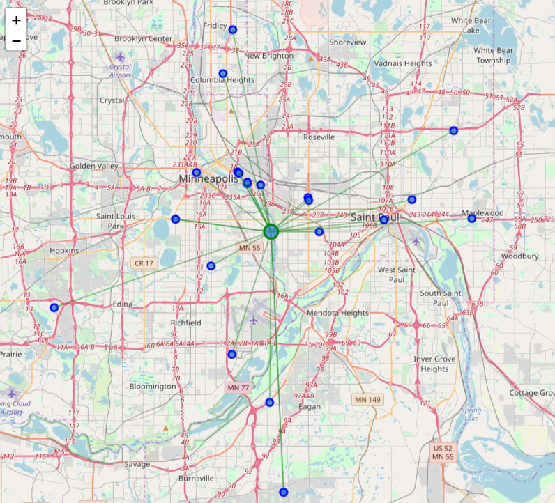
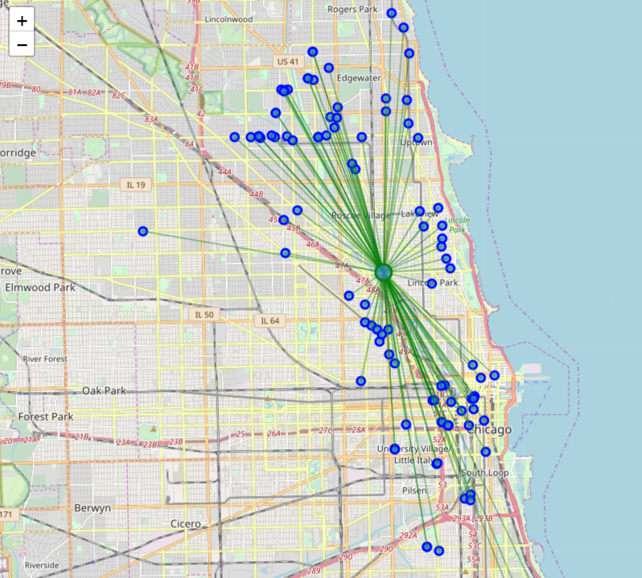
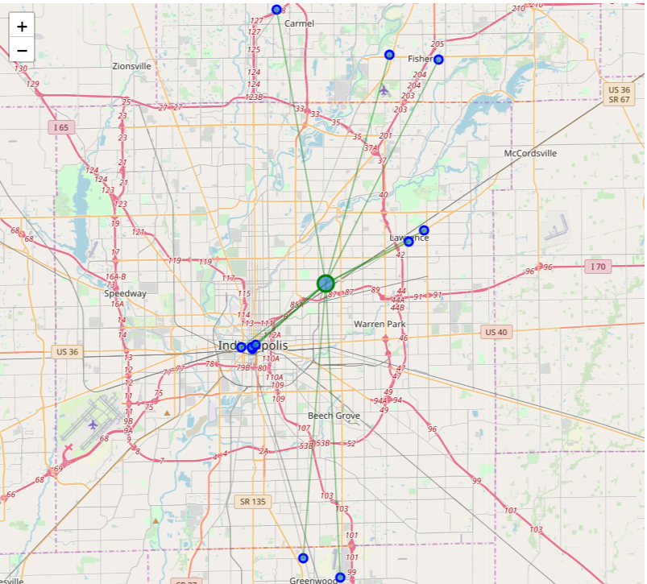
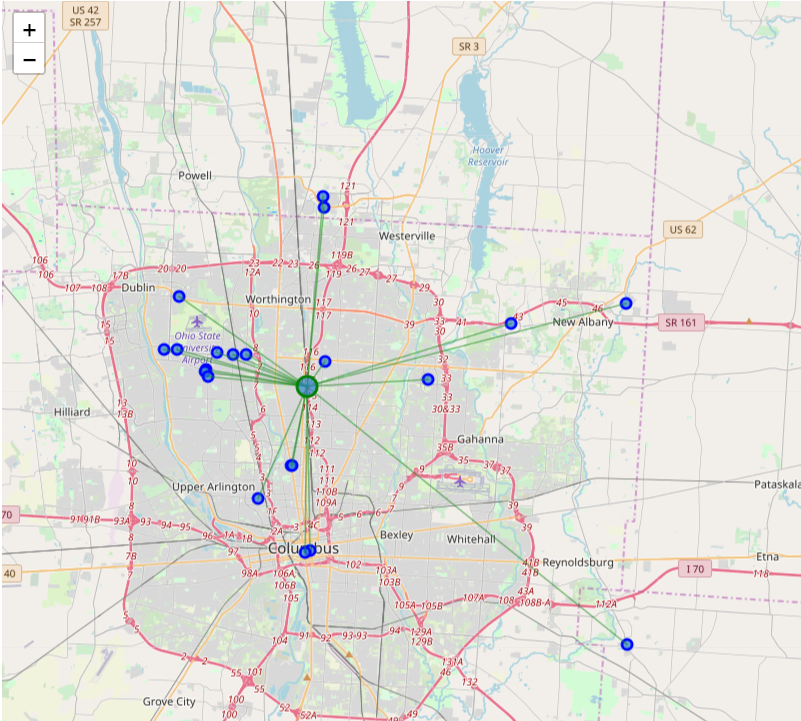
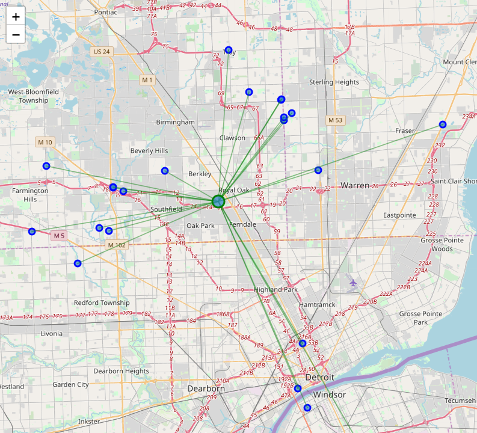
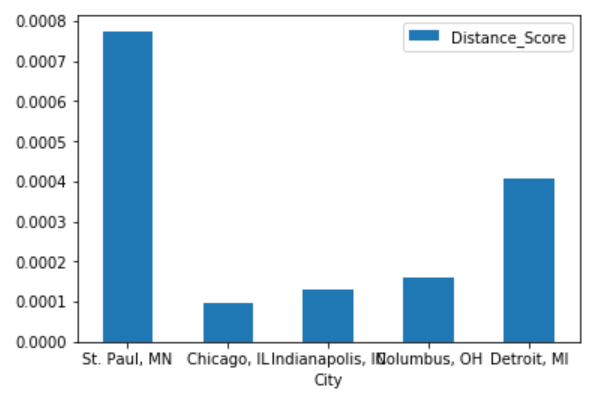
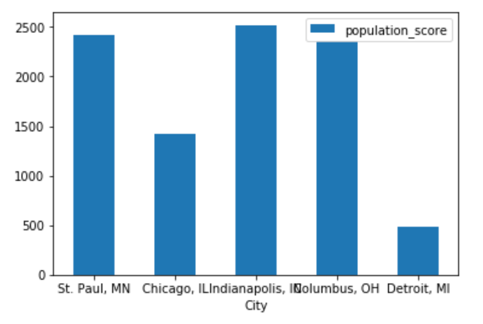

# New Korean Restaurant Location among 5 major cities in Midwest

## St. Paul, MN, Chicago, IL, Indianapolis, IN, Detroit,MI, Columbus,OH 

Data Science Capstone Course

## Introduction

We are trying to open a new Korean Restaurant in Midwest. However, Midwest cities are not as populated as coast cities. 
Therefore, we consider only five cities. St. Paul, Chicago, Indianapolis, Detroit, and Columbus. 

Another factor we want to consider is competition. We don't want to open new restaurant where many Korean restaurants are located. 

We want to find a city where Korean restarants are spread out ranther than concentrated. 
We want to fidn a city with high Asain population.  
We want to fidn a city with small number of Korean restaurants  
In short, we want to find a city with lowest competition. 
## Data

I will use **FourSqaure API** to get the locations and Numbers of Korean restaurants in each cities. And I also use the Asian population information and areas from https://worldpopulationreview.com/us-cities for each cities. 
The data from 'worldpopulationreview.com' doesn't exist as a one table, it ahs been obtained maually. I choose Asian Population. Most of customers in Korean Restaurant are Korean. And secondly, other Asian. Of couse, Korean food s getting popular among white population also.
To simplify the analysis, I choose Asian.

I collect the land areas of the cities. I don't think it is critical choosing either land area or total area, since there is high correlation between them.
However, I choose land area assuming nobody lives on the water.

|City|Asian Population|Area|
|----|----|----|
|St. Paul|55,669|134.61|
|Chicago|175,109|588.81|
|Indianapolis|27,717|948.96|
|Columbus|49,616|566.18|
|Detroit|10,659|359.28|

## Measures for low Competition 
### 1. Average Distance per Area
If the restaurants are widely spread over, they don't share many people. (think about the case all the restaurant are located in one place)
Therefore, the higher average distance from the center, the less competition. 
However, the distance is relative to the size of the city. The same distance can be considered as a long distance in samll town and can be considered as short distance in a large city.
Therefore, I calculate the average distance per area. Here, Area is Land area in $km^2$, assuming none lives on the water.

### 2. Number of People per restaurant
As we can see Chicago dominates the others in the number of Korean Restaurants. However, it doesn't mean, its competition is high. We have to consider the number of potential customers.
Therefore, I calculate the number of Asian poeple per restaurant. If this number is high, it means the competition is low, since there are many potential customers for each restaurant.

## Results of Analysis
### 1. Number of Restaurants

|City|	Number of Restaurants|
|----|----|
|St. Paul, MN	|23|
|Chicago, IL	|123|
|Indianapolis, IN|	11|
|Columbus, OH	|21|
|Detroit, MI	|22|

### 2. Average Distance from the center
The center is calcualted by averaging latitudes and logitudes of restaurants. It means the center is the center of the restaurants.

|City|Average Distance|
|----|----|
|St. Paul, MN	|0.104295|
|Chicago, IL	|0.056442|
|Indianapolis, IN	|0.124167|
|Columbus, OH	|0.091155|
|Detroit, MI	|0.145858|

### St Paul - Korean Restaurants

### Chicago - Korean Restaurants

### Indianapolis - Korean Restaurants

### Columbus - Korean Restaurants

### Detroit - Korean Restaurants

### 3. Population and area information
|City|Asian Population|Area|
|----|----|----|
|St. Paul|55,669|134.61|
|Chicago|175,109|588.81|
|Indianapolis|27,717|948.96|
|Columbus|49,616|566.18|
|Detroit|10,659|359.28|

### 4. Merged info + Measures 

|City|	Numbers|	Average Distance	|Asian Population	|LandArea	|Distance_Score	|Population_score|
|----|----|----|----|----|----|----|
|	St. Paul, MN|	23|	0.104295|	55669|	134.61|	0.000775|	2420.39|
|	Chicago, IL|	123|	0.056442|	175109|	588.81|	0.000096|	1423.65|
|	Indianapolis, IN|	11|	0.124167|	27717|	948.96|	0.000131|	2519.73|
|	Columbus, OH|	21|	0.091155|	49616|	566.18|	0.000161|	2362.67|
|	Detroit, MI|	22|	0.145858|	10659|	359.28|	0.000406|	484.5|

### Average Distance per Area comparison

### Number of People are Restaurant Comparison

## Conclusion
According to the two measures I choose, St. Paul is the best city for new Korean restaurant, because it shows the lowest competition among Korean Restarants.
In the Average Distance per area, St. Paul dominates the others. It means Korean restaurants are wide-spread with the consideration of the size of the city.
In the number of asian people per restaurant, St. Paul is not the best but the second highest. And the difference from that of Indiapolis, the top city, is less than 5%.
Therefore, I believe St. Paul is the best plce for a new Korean restaurant, due to the lowest conpetition among Korean Restaurants. 
